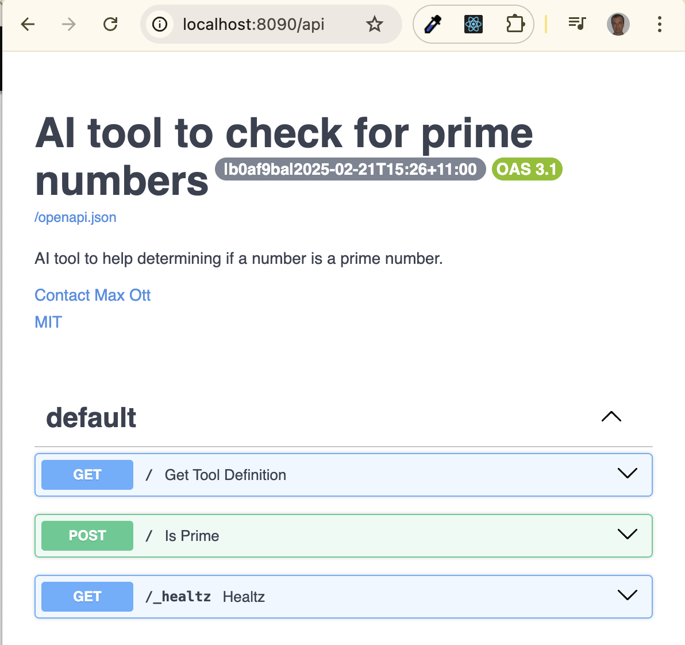

# Sciansa Tool Integration

If you are new to development for Sciansa see https://github.com/csiro-internal/sciansa-integration for higher level
topics.

This is the most basic beginner tutorial (akin to Hello World!). If you want a more advanced tutorial see the additional
tutorials listed here https://github.com/csiro-internal/sciansa-integration?tab=readme-ov-file#further-reading .

This document is currently in the process of being updated. If needed you can revert to the original version by jumping
to https://github.com/ivcap-works/ivcap-python-ai-tool-template.

**Quick Start:** Jump straight to [Local Development and Testing](#local-development-and-testing).


# Design

Before integrating your tool into Sciansa make sure you consider how your tool will fit into the system architecture.
Ultimately Sciansa is a modular system with each unit having inputs and outputs. How well you define your tools
abstraction and what you choose as the inputs and outputs for your tool module will effect how useful your tool is
within the Sciansa ecosystem. Higher level modular design principles can be found in
[https://github.com/csiro-internal/sciansa-integration](https://github.com/csiro-internal/sciansa-integration).


# Beginners

If you are just starting out it is recommended that you use this repo as a template to guide your development. This repo
is a GitHub template __TODO explain how to use GitHub template.__

This guide targets developers who want to integrate classical tools with well defined inputs and outputs. If you want to
support an agent interaction pattern see the
[Hybrid section in the Sciansa Integration Docs](https://github.com/csiro-internal/sciansa-integration?tab=readme-ov-file#hybrid-advanced).


# Assessing Integration Complexity

The following list will help you to identify how complex it will be to integrate your tool with Sciansa:

**Dependencies:** \
How well do you understand your dependencies? Have you tried to put your technology in a Docker container? \
Tools with well understood dependencies or have been containerised before are easier to integrate.

How big are your dependencies?
This include everything that needs to be packaged to make your tool work (everything beyond the inputs and outputs).

**Dependency Compaitability:** \
Is the tool compaitable with the Sciansa dependency set? See: [Technologies](#technologies) \
Identify any significant incompaitabilities between the dependencies used by Sciansa and the technologies that you use.

**State:** \
Does the tool maintain an internal state or is is stateless? \
Stateless tools are easier to integrate then tools that require state preservation between calls.

**Resources:** \
What are the compute resources required? \
If your tool requires subtaintial compute or GPU resources talk with the Sciansa team in the first instance to see if
your compute requirements can be accomdated by the platform.

**Inputs and Outputs:** \
What are the expectations on the Inputs and Outputs for your tool? \
What is the order of magnitude of data required as inputs and outputs for your tool(s) and where are they stored? \
Tools that can accomodate inputs and outputs in standardised formats and that can be written to take these inputs and
outputs as parameters (rather then hard coded files) are easier to integrate.

**Configuration:** \
How is the tool configured? \
Are you able to supply a set of parameters or does the tool have a GUI or interactive workflow? \
Tools that can be configured up front without requiring further interaction are easier to integrate then tools that
need supervisory interactive configuration patterns.

**Extend This List:** \
Thought that your tool would be easy to integrate based on the above list and then found it harder then you expected? \
Please reach out for help and support. \
Also, please make update this list to reflect the additional constraints that made the integration more complex.


# Technologies

These are the technologies that you will need to use to integrate your tool into Sciansa:

The following matrix defines the technologies you will need to use to integrate your tool. If you are starting from
scratch it is recommended that you use the default options. If you are integrating an existing tool the matrix
highlights compaitability.

Type                     | Technology | New Project  | Existing Compatability
-------------------------|------------|--------------|-------------------------
Language                 | Python     | Mandtory     | Mandatory
Library                  | Pydantic   | Madatory     | Mandatory
Test Framework           | Unknown    | Recommended  | Recommended but optional
Build System             | Make       | TODO Replace | TODO Replace
Dependency Managment     | Poetry     | Mandatory    | Mandatory
Deployment               | Docker     | Mandatory    | Mandatory
Infrastructure Framework | IVCAP      | Mandatory    | Mandatory


If you are not familiar with IVCAP the best brief introduction can be found in the IVCAP section of the [Sciansa
Developer Documentation](https://github.com/csiro-internal/sciansa-integration#IVCAP).


# Local Development and Testing

We start by building the template as is to verify the development environment and start in a known good working state.


## Install Development Dependencies:

After installing the dependencies you should be able to run the commands provided to check the dependencies are
correctly installed by verifying the expected output (versions may differ slightly).

- [Install Git](https://git-scm.com/downloads)
- [Install IVCAP CLI](https://github.com/ivcap-works/gene-onology-term-mapper?tab=readme-ov-file#step-2-install-ivcap-cli-tool)
- [Install Poetry](https://github.com/ivcap-works/gene-onology-term-mapper?tab=readme-ov-file#step-1-install-poetry-and-ivcap-plugin)
- [Install Docker](https://docs.docker.com/engine/install/)
- Test Install with:
```
$ git version
# Expect: git version 2.43.0

$ poetry --version
# Expect: Poetry (version 2.1.4)

$ poetry ivcap version
# Expect: IVCAP plugin (version 0.5.2)

$ ivcap --version
# Expect: ivcap version 0.41.7|c32cf2b|2025-07-02T00:12:10Z

$ ivcap context get
# Expect:
# +-------------+---------------------------------------------------------+
# | Name        | sd-dev                                                  |
# | URL         | https://develop.ivcap.net                               |
# | Account ID  | urn:ivcap:account:00000000-0000-0000-0000-000000000000  |
# | Provider ID | urn:ivcap:provider:00000000-0000-0000-0000-000000000000 |
# | Authorised  | yes, refreshing after 01 Jan 25 12:34 AEST              |
# +-------------+---------------------------------------------------------+

$ docker --version
# Expect: Docker version 28.1.1+1, build 068a01e

$ docker run hello-world
# Expect:
# Unable to find image 'hello-world:latest' locally
# latest: Pulling from library/hello-world
# 17eec7bbc9d7: Pull complete
# Digest: sha256:a0dfb02aac212703bfcb339d77d47ec32c8706ff250850ecc0e19c8737b18567
# Status: Downloaded newer image for hello-world:latest
#
# Hello from Docker!
# ...
```


## Default Functionality:

The default functionality/operation that this template implements is to check whether a number is prime.

|            | Description |
|------------|-------------|
| **Input**  | Integer     |
| **Output** | Boolean indicating whether the input was prime. |

This default functionality provides a simple and well understood operation that you can test with until you are ready to
replace the logic with your own.


## Build Template:
- Install Dependencies:
```
$ poetry install --no-root
# Expect:
# Installing dependencies from lock file
#
# Package operations: 74 installs, 0 updates, 0 removals
#
# - Installing ...
```
- Build:
```
$ poetry ivcap docker-build
# Expect:
# INFO: docker buildx build -t ivcap_python_ai_tool_template_x86_64: ...
# ...
# INFO: Docker build completed successfully
```


## Test Build:

In order to quickly test this service, follow these steps:
```
$ poetry ivcap run -- --port 8080
# Expect:
Running: poetry run python tool-service.py --port 8080
2025-05-28T16:24:14+1000 INFO (app): AI tool to check for prime numbers - 0.2.0|b4dbd44|2025-05-28T16:24:13+10:00 - v0.7.2
2025-05-28T16:24:14+1000 INFO (uvicorn.error): Started server process [6311]
2025-05-28T16:24:14+1000 INFO (uvicorn.error): Waiting for application startup.
2025-05-28T16:24:14+1000 INFO (uvicorn.error): Application startup complete.
2025-05-28T16:24:14+1000 INFO (uvicorn.error): Uvicorn running on http://0.0.0.0:8080 (Press CTRL+C to quit)
```

In a separate terminal, call the service via `make test-local` or your favorite http testing tool:
_TODO: Replace this step. Remove the need for make as a dependency, replace with Python (since its already a dependency)._
_For now you will also need to make sure that you haev `make` installed as a dependency on your system._
```
$ make test-local
# Expect:
# curl -i -X POST \
#     -H "content-type: application/json" \
#     --data @tests/request.json \
#     http://localhost:8080
# HTTP/1.1 200 OK
# date: Tue, 22 Jul 2025 06:32:39 GMT
# server: uvicorn
# job-id: urn:ivcap:job:1f066c5a-a3b4-6f84-a5f7-9eae9cc90b25
# content-length: 67
# content-type: application/json
# ivcap-ai-tool-version: 0.7.15
#
# {"$schema":"urn:sd:schema.is-prime.1","number":997,"is_prime":true}
```

The output from this command shows 3 things:
- Shows the call that was made to the service.
- Shows the HTTP responce we recieve from the platform.
- Shows the data in the reponce we recieved from the platform (that 997 is prime).

You can also verify the build and view the web service is available by navigating to
[http://localhost:8080/api](http://localhost:8080/api). Here you will find the OpenAPI spec for the endpoints the
service creates.




# Deployment

It might seem odd to have deployment first. After all why deploy the template? The aim of this tutorial is to start with
something that works and progressivly increase the understanding and customisation.

There are 2 options for remote deployment:

| | |
|---------------------------------|-------------------------------------------|
| Automated deployment (Prefered) | - Requirment: All code / models pushed to GitHub repo. </br> - Runs an automated job to build and deploy the container. </br> Advantage: Reproducable |
| Manual deployment               | - Requirement: Developer must understand deployment process. </br> - You manually build and upload your tool. |


## Automated Deployment

- _TODO: To Be Defined. Not yet implemented._


## Manual Deployment

Deployment is a three step process:
1. Building and deploying the docker image
1. Registering the service
1. Registering the tool description

All this can be accomplished with a single command:
```
poetry ivcap deploy
```


### Test deployed Service

After you have deployed the service you can test the deployment using the following steps.

Run `poetry ivcap job-exec tests/request.json` to execute the service to check if '997' is a prime number
(`{"number": 997}`):

```
$ poetry ivcap job-exec tests/request.json
# Expect:
# ...
# Creating job 'https://develop.ivcap.net/1/services2/urn:ivcap:service:.../jobs'
# ...
# "result-content": {
#   "$schema": "urn:sd:schema.is-prime.1",
#   "is_prime": true,
#   "number": 997
# },
```

> For a more in-depth description of deployment, please refer to
[Step 8: Deploying to IVCAP](https://github.com/ivcap-works/gene-onology-term-mapper?tab=readme-ov-file#step-8-deploying-to-ivcap-)
in the [Gene Ontology (GO) Term Mapper](https://github.com/ivcap-works/gene-onology-term-mapper) tutorial.


# Next Steps

Great you have completed the introductory tutorial. You may now want to look at a more advanced tutorial. See either:
- (Advanced tool tutorial)[https://github.com/ivcap-works/gene-onology-term-mapper]
- (Example Integrations)[https://github.com/csiro-internal/sciansa-integration?tab=readme-ov-file#example-integrations]


# Maintainers Notes

Here are some dot points to help future maintainers of this document and this repo:
- **Intended Audience:**
  - Assumed to have a competent understatanding of the tool they plan to integrate.
  - Assumed to be a domain expert with competent level of programming profiecency. The assumption is that the developers
    who want to integrate tools will have a resonable level of programming proficency, but will not necessarily be
    professional programmers. They are likely to have deep expereince in tools sets and libraries they are familiar with
    but may not have a deep understanding of tools and technologies across a broader development concepts (for example
    they may not have experience with cloud infrustructure, Docker, JSON or web APIs).
  - Assumed have a resonable familiarity with Python.

-----

Old readme follows. To remove at some point in the future.

# IVCAP "AI Tool" Demo


## Use <a name="test"></a>

Below is an example of an agent query which uses this tool:
```
{
  "$schema": "urn:sd-core:schema:llama-agent.request.1",
  "name": "Agent query test",
  "msg": "is 997 a prime number?",
  "tools": [
    "urn:sd-core:ai-tool:is_prime"
  ],
  "verbose": true
}
```

## Build & Deploy <a name="build"></a>

The tool needs to be packed into a docker container, and the, together with an IVCAP service description
deployed to an IVCAP platform.


> **Note:** Please make sure to have the IVCAP cli tool installed and configured. See the
[ivcap-cli](https://github.com/ivcap-works/ivcap-cli) repo for more details.

## Deploying to Platform


## Implementation <a name="implementation"></a>

### [tool-service.py](./tool-service.py)

Implements a simple http based service which provides a `POST /` service endpoint to test
if the number contained in the request is a prime number or not.

We first import a few library functionss and configure the logging system to use a more "machine" friendly format to simplify service monitoring on the platform.

```
import math
from pydantic import BaseModel, Field
from pydantic import BaseModel, ConfigDict

from ivcap_service import getLogger, Service
from ivcap_ai_tool import start_tool_server, ToolOptions, ivcap_ai_tool, logging_init

logging_init()
logger = getLogger("app")
```

We then describe the service, who to contact and other useful information used whne deploying the service

```
service = Service(
    name="AI tool to check for prime numbers",
    contact={
        "name": "Max Ott",
        "email": "max.ott@data61.csiro.au",
    },
    license={
        "name": "MIT",
        "url": "https://opensource.org/license/MIT",
    },
)
```

The core function of the tool itself is accessible as `POST /`. The service signature should be kept as simple as possible.
We highly recommend defining the input as well as the result by a single `pydantic` model, respectively.
However, for a tool to be properly used by an Agent, we should provide a
comprehensive function documentation including the required parameters as well as the reply.

Please also note the `@ivcap_ai_tool` decorator. It exposes the service via `POST \`, but also a `GET /`
to allow the platform to obtain the tool description which can be used by agents to select the right
tool but also understand on how to use it.

```
class Request(BaseModel):
    jschema: str = Field("urn:sd:schema:is-prime.request.1", alias="$schema")
    number: int = Field(description="the number to check if prime")

class Result(BaseModel):
    jschema: str = Field("urn:sd:schema:is-prime.1", alias="$schema")
    flag: bool = Field(description="true if number is prime, false otherwise")

@ivcap_ai_tool("/", opts=ToolOptions(tags=["Prime Checker"]))
def is_prime(req: Request) -> Result:
    """
    Checks if a number is a prime number.
    """
    ...
    return Result(flag=True)
```

Finally, we need to start the server
to listen for incoming requests:

```
# Start server
if __name__ == "__main__":
    start_tool_server(service)
```

## [resources.json](./resources.json)

This file contains the resource requirements for this tool. This will depend on the computational and memory
requirements for the specific tool. If it is not provided a default will be used which is likely very similar
to this file.
